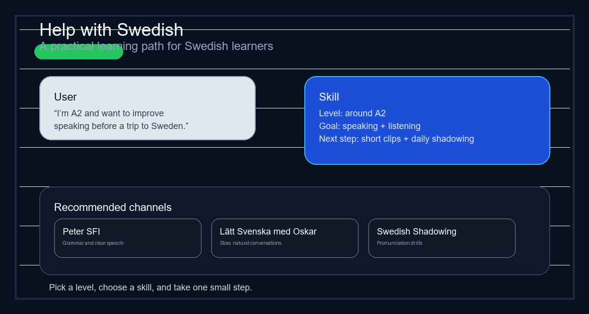

# کمک به زبان سوئدی — یک Claude Skill

[فارسی](README.fa.md) · [English](README.md) · [Svenska](README.sv.md)

یک Claude Skill برای کمک به زبان‌آموزان سوئدی در پیدا کردن کلیپ‌های یوتیوب و پادکست‌های مناسب با سطح و هدف یادگیریشان.

بیشتر راهنمایی‌های یادگیری زبان یا خیلی کلی هستند یا خیلی شلوغ. این Skill با پرسیدن سطح کاربر و هدف او، پیشنهادهای دقیق‌تر و کاربردی‌تری ارائه می‌دهد.

## استفاده در ۳۰ ثانیه

1. [hjälp_om_svenska.skill](hjälp_om_svenska.skill) را دانلود کنید.
2. آن را در Claude باز کنید.
3. برای مثال این سؤال را بپرسید: «من در سطح A2 هستم و می‌خواهم قبل از سفر به سوئد صحبت کردنم را بهتر کنم.»

## دمو

یک کاربر می‌گوید: «من در سطح A2 هستم و می‌خواهم قبل از سفر به سوئد صحبت کردنم را بهتر کنم.» Skill با یک برنامه کوتاه، چند ویدیو یا پادکست مرتبط و یک قدم بعدی روشن پاسخ می‌دهد.



## این Skill چه کاری انجام می‌دهد

- مسیر یادگیری را بر اساس سطح، هدف و مهارت انتخاب می‌کند.
- ویدیوهای یوتیوب و اپیزودهای پادکست را برای گوش دادن، خواندن، نوشتن و صحبت کردن پیشنهاد می‌دهد.
- کانال‌های کاربردی مانند Peter SFI، Lätt Svenska med Oskar، UR Play و Swedish Shadowing، و همچنین پادکست‌هایی مانند Radio Sweden på lätt svenska، Klartext و Fluent Fiction – Swedish را در اولویت قرار می‌دهد.
- راهنمایی‌ها را کوتاه، Encouraging و قابل دنبال کردن نگه می‌دارد.

## چرا این Skill وجود دارد

بسیاری از زبان‌آموزان وقت خود را در ویدیوهای بی‌ربط یا بیش از حد سخت/آسان هدر می‌دهند. این Skill کمک می‌کند تا انتخاب‌ها دقیق‌تر و مسیر یادگیری واقعی‌تر باشد.

## نصب

گزینه A — یک فایل: [hjälp_om_svenska.skill](hjälp_om_svenska.skill) را دانلود کنید و در Claude باز کنید.

گزینه B — بسته‌بندی محلی:

```bash
python package_skill.py
python package_skill.py --check
python package_skill.py --install --skills-dir <path-to-skills-folder>
```

دستور `--check` قبل از استفاده از بسته، وجود فایل‌های لازم را بررسی می‌کند.

## نحوه استفاده

از متن‌های زیر استفاده کنید:

- «می‌خواهم بهبود Listening سوئدی ام را برای مکالمات روزمره شروع کنم.»
- «من مبتدی هستم و می‌خواهم یک برنامه ساده برای صحبت کردن داشته باشم.»
- «برای تمرین خواندن در سطح B1، ویدیوهای خوب سوئدی پیشنهاد بده.»
- «یک پادکست سوئدی برای رفت‌وآمدم پیشنهاد بده.»
- «می‌خواهم یک برنامه دو هفتگی برای یادگیری سوئدی برای کار داشته باشم.»
- «من در سطح A2 هستم و می‌خواهم دایره واژگانم را قبل از مهاجرت به سوئد بهتر کنم.»
- «من فکر می‌کنم در سوئدی intermediate هستم، اما مطمئن نیستم واقعاً در کجا قرار می‌گیرم.»

یک پاسخ خوب معمولاً شامل این موارد است:

- یک ارزیابی کوتاه از سطح یا یک پیشنهاد مرتبط،
- ۳ تا ۵ ویدیو، پلی‌لیست یا اپیزود پادکست،
- و یک قدم بعدی واضح برای کاربر.

یک مثال قوی به این شکل است:

> «به نظر می‌رسد شما در سطح A2 هستید. یک قدم بعدی خوب، تمرین گوش دادن و تمرین‌های کوتاه صحبت کردن است. من سه ویدیوی کوتاه و یک برنامه روزانه ساده پیشنهاد می‌کنم.»

## این Skill چه کمکی می‌کند

- انتخاب یک قدم بعدی خوب برای یادگیری سوئدی
- تطبیق کاربر با مسیر مناسب بر اساس سطح
- پیشنهاد منابع عملی یوتیوب و پادکست بدون اینکه کاربر را overwhelmed کند

## این Skill جایگزین چه چیزی نیست

- ارزیابی رسمی زبان
- تست سطح توسط معلم
- امتیاز قطعی CEFR

## ساختار

- hjälp_om_svenska/SKILL.md — دستورالعمل‌های Skill
- hjälp_om_svenska/references/ — فایل‌های مرجع با کانال‌ها، پادکست‌ها و مثال‌ها
- hjälp_om_svenska.skill — بسته‌ی آماده‌ی Skill
- package_skill.py — بسته را می‌سازد

## ساخت

اجرای دستور زیر:

```bash
python package_skill.py
```

## مشارکت

مشارکت‌ کننده ها خوش‌آمدید. اگر کانال‌های بهتر، مثال‌های روشن‌تر یا راهنمایی‌های قوی‌تر دارید، خوشحال می‌شویم کمک کنید.

## مجوز

این پروژه تحت مجوز MIT منتشر شده است.

## درباره پروژه

این مخزن، یک Claude Skill برای زبان‌آموزان سوئدی ارائه می‌دهد که می‌خواهند پیشنهادهای کاربردی و سطح‌بندی شده دریافت کنند بدون اینکه overwhelmed شوند.
