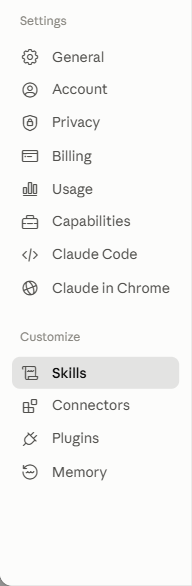
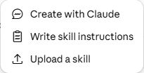
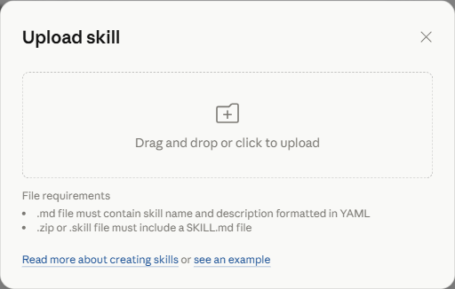

# Hjälp med svenska — en Claude Skill

[Svenska](README.sv.md) · [English](README.md) · [فارسی](README.fa.md)

En Claude Skill som hjälper människor att hitta YouTube-klipp och poddar som passar deras nivå och mål när de lär sig svenska.

Många får svårt att välja rätt material när de lär sig ett nytt språk. Den här skillen gör det enklare genom att ge korta, konkreta förslag istället för slumpmässiga videor.

## Testa direkt — fungerar i vilken AI-chatt som helst

Inget att ladda ner eller installera. Kopiera rutan nedan, klistra in den som ditt första meddelande i ChatGPT, Gemini, Claude, Copilot eller någon annan AI-chatt, och ställ sedan din fråga. Texten i rutan är instruktioner till AI:n och är därför på engelska, men AI:n svarar dig ändå på svenska (eller vilket språk du skriver på).

Se hela texten i [universal-prompt.md](universal-prompt.md) (samma innehåll som i den engelska README:n).

## Inget konto, ingen AI-chatt — bara en webbsida

Vill du inte använda någon AI-chatt alls? Välj din nivå och färdighet på en enkel webbsida och få samma lista tillbaka:

- Live: https://mh-mansouri.github.io/help_with_swedish/
- Eller ladda ner [docs/index.html](docs/index.html) och öppna den i valfri webbläsare — ingen server, ingen installation, inget konto.

Den anropar samma [Live API](#live-api) som beskrivs nedan, så resultaten matchar det som skillen och copy-paste-prompten rekommenderar.

## Installera som en permanent Claude Skill

Vill du slippa klistra in texten varje gång och istället få den att aktiveras automatiskt i Claude? Detta kräver ett Claude Pro-, Max-, Team- eller Enterprise-konto — Skills finns inte på gratisplanen.

1. Ladda ner [swedish_mentor.skill](swedish_mentor.skill).
2. På [claude.ai](https://claude.ai), klicka på ditt namn längst ner till vänster och välj **Settings**. Öppna sidan **Skills** under Customize:

   

3. Klicka på **Add skill**, sedan **Upload a skill**:

   

4. Dra den nedladdade filen `swedish_mentor.skill` till uppladdningsrutan (eller klicka för att bläddra) och bekräfta:

   

5. Starta en ny chatt och fråga till exempel: “Jag är på A2-nivå och vill bli bättre på att prata inför en resa till Sverige.”

Vill du bygga paketet själv istället för att använda den färdiga filen?

```bash
python package_skill.py
python package_skill.py --check
python package_skill.py --install --skills-dir <sökväg-till-skills-mapp>
```

Kommandot `--check` kontrollerar att alla nödvändiga filer finns innan du använder paketet.

## Demo

En användare skriver: “Jag är på A2-nivå och vill bli bättre på att prata inför en resa till Sverige.” Skillen svarar med en kort plan, några relevanta klipp eller poddavsnitt och ett tydligt nästa steg.


## Vad den gör

- Väljer en lärväg utifrån nivå, mål och färdighet.
- Föreslår videor och poddavsnitt för lyssning, läsning, skrivning och tal.
- Prioriterar praktiska kanaler som Peter SFI, Lätt Svenska med Oskar, UR Play och Swedish Shadowing, samt poddar som Radio Sweden på lätt svenska, Klartext och Fluent Fiction – Swedish.
- Håller rekommendationerna korta, uppmuntrande och lätt att följa.

## Varför den finns

Många läser eller tittar på material som är antingen för svårt eller för enkelt. Den här skillen hjälper till att undvika det och ger ett mer realistiskt sätt att lära sig steg för steg.

## Live API

Samma rekommendationer finns också som ett REST API, driftsatt på Render:

- Bas-URL: https://help-with-swedish-api.onrender.com
- Interaktiv dokumentation: https://help-with-swedish-api.onrender.com/docs

Körs på en gratisinstans, så den stängs av vid inaktivitet — första anropet efter ett tag kan ta ~50 sekunder. Se [api/README.md](api/README.md) för endpoints och lokal installation.

## Hur du använder den

Testa frågor som:

- “Jag vill bli bättre på att förstå vardagligt svenska.”
- “Jag är nybörjare och vill ha en enkel plan för att prata.”
- “Ge mig bra svenska videor för läsning på nivå B1.”
- “Föreslå en svensk podd för min pendling.”
- “Jag vill ha en plan på två veckor för att lära mig svenska inför jobbet.”
- “Jag är på A2-nivå och vill förbättra mitt ordförråd inför en flytt till Sverige.”
- “Jag tror att jag är intermediate i svenska, men jag är inte säker på var jag egentligen hör hemma.”

En bra respons brukar innehålla:

- en kort nivåbedömning eller förslag,
- 3–5 videor, spellistor eller poddavsnitt,
- och ett tydligt nästa steg för användaren.

Ett starkt exempel ser ut så här:

> “Du verkar ligga runt A2. Ett bra nästa steg är lyssningsövningar och korta pratövningar. Jag rekommenderar tre korta klipp och en enkel daglig rutin.”

## Vad den hjälper till med

- Att välja ett bra nästa steg i svenskstudier
- Att matcha användaren till en nivåanpassad väg
- Att föreslå praktiska YouTube- och poddresurser utan att överväldiga användaren

## Vad den inte ersätter

- En formell språktestning
- En lärarledd nivåplacering
- En garanterad CEFR-betyg

## Struktur

- swedish_mentor/SKILL.md — instruktionerna för skillen
- swedish_mentor/references/ — referensfiler med kanaler, poddar och exempel
- swedish_mentor.skill — den paketerade skillfilen
- assets/install-steps/ — skärmdumpar för installationsguiden
- docs/index.html — fristående webbsida som anropar det live API:et direkt
- package_skill.py — bygger paketet

## Bygg

Kör:

```bash
python package_skill.py
```

## Bidra

Bidrag är välkomna. Om du har bättre kanaler, tydligare exempel eller starkare vägledning är du välkommen att bidra.

## Licens

Detta projekt är licensierat under MIT-licensen.

## Om projektet

Det här repo:t paketerar en Claude Skill för personer som vill lära sig svenska på ett enkelt och praktiskt sätt.
